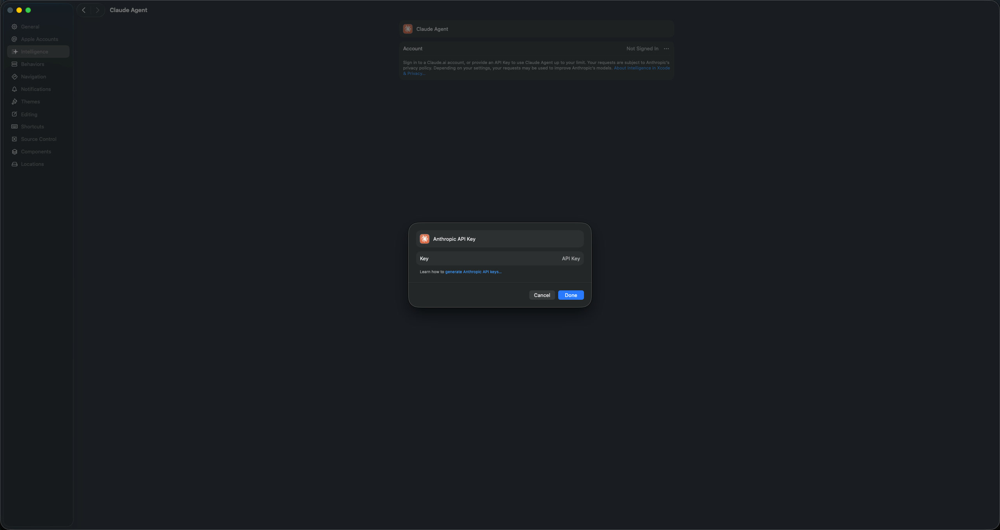

# Xcode Claude SDK 代理助手

一款轻量级 macOS 工具，用于为 **Xcode 26.3+ 内置 Claude SDK** 配置代理环境变量。

[English](README.md)

## 背景

从 **Xcode 26.3** 开始，Apple 集成了 [Anthropic Claude SDK](https://www.anthropic.com/) 以提供 AI 编程辅助功能。Xcode 中的 Claude SDK 通过读取 `ANTHROPIC_BASE_URL` 和 `ANTHROPIC_AUTH_TOKEN` 环境变量来确定 API 端点和凭证。

## 为什么需要这个工具？

如果你需要将 Claude SDK 的 API 请求通过代理转发（例如网络受限、企业环境或使用自定义 API 网关），你会发现 macOS 的 GUI 应用（如 Xcode）**不会**继承 Shell 环境变量（`~/.zshrc`、`~/.bashrc`），因此在终端中设置 `ANTHROPIC_BASE_URL` 对 Xcode **无效**。

本工具通过 macOS `launchctl` 在**系统会话级别**设置环境变量，使所有 GUI 应用（包括 Xcode 及其内置 Claude SDK）都能读取到这些变量。

## 功能特性

- 全局设置 `ANTHROPIC_BASE_URL` 和 `ANTHROPIC_AUTH_TOKEN`，对 Xcode 26.3+ Claude SDK 生效
- 通过 macOS LaunchAgent 持久化配置（重启后自动恢复）
- 一键应用、一键移除
- 双语界面（English / 简体中文）
- 原生 SwiftUI macOS 应用

## 系统要求

- macOS 15.0 或更高版本
- Xcode 26.3 或更高版本（内置 Claude SDK 支持）

## 安装

### 方式一：下载发布版

从 [Releases](../../releases) 页面下载最新的 `.app`，拖入 `/Applications` 后打开即可。

### 方式二：从源码构建

```bash
git clone https://github.com/user/ClaudeForXcodeProxy.git
cd ClaudeForXcodeProxy
open ClaudeForXcodeProxy.xcodeproj
```

在 Xcode 中构建并运行（⌘R）。

## 使用方法

1. **打开**应用
2. **输入**代理 Base URL（例如 `https://your-proxy.example.com/v1`）
3. **输入** Auth Token
4. **点击**「应用设置」
5. **重启 Xcode** 使配置生效

### 移除配置

点击「删除配置」可卸载 LaunchAgent 并删除持久化的 plist 文件，然后重启 Xcode。

## 工作原理

应用设置时执行两个操作：

1. **立即生效**：调用 `launchctl setenv` 在当前用户会话中设置 `ANTHROPIC_BASE_URL` 和 `ANTHROPIC_AUTH_TOKEN`。
2. **持久化**：在 `~/Library/LaunchAgents/com.xcodeClaudeEnvConfig.setenv.plist` 创建 LaunchAgent 配置（`RunAtLoad: true`），确保每次登录后自动恢复环境变量。

### 环境变量说明

| 变量 | 说明 |
|---|---|
| `ANTHROPIC_BASE_URL` | Xcode Claude SDK API 请求的代理地址 |
| `ANTHROPIC_AUTH_TOKEN` | 代理的认证令牌 |

## 项目结构

```
ClaudeForXcodeProxy/
├── ClaudeForXcodeProxy/
│   ├── XcodeClaudeEnvConfigApp.swift   # 应用入口
│   ├── ContentView.swift               # 主界面
│   ├── LaunchAgentManager.swift        # 核心逻辑（launchctl + plist）
│   ├── Localizable.xcstrings           # 本地化（en / zh-Hans）
│   └── Assets.xcassets                 # 应用资源
└── README.md
```

## 重要提示：Xcode API Key 设置

> **注意：** 使用本工具设置环境变量后，Xcode 可能仍然显示 Claude Agent 为「Not Signed In」，并要求你输入 Anthropic API Key。此时请前往 **Xcode 设置 → Intelligence → Claude Agent**，点击 API Key 输入框，**随便填入一个字符串**（例如 `placeholder`）以绕过限制，然后点击 **Done**。实际的 API 请求仍然会通过环境变量配置的代理进行路由。



## 常见问题

**Q：为什么应用设置后需要重启 Xcode？**
A：Xcode 在启动时读取环境变量。通过 `launchctl setenv` 修改的变量只对新启动的进程生效。

**Q：会影响其他应用吗？**
A：是的，`ANTHROPIC_BASE_URL` 和 `ANTHROPIC_AUTH_TOKEN` 设置在用户会话级别，所有 GUI 应用都可见。这是设计如此，可以让所有使用 Anthropic SDK 的工具都通过代理。

**Q：配置文件存储在哪里？**
A：`~/Library/LaunchAgents/com.xcodeClaudeEnvConfig.setenv.plist`

**Q：如何验证变量已设置？**
A：打开终端运行：
```bash
launchctl getenv ANTHROPIC_BASE_URL
launchctl getenv ANTHROPIC_AUTH_TOKEN
```

## 许可证

MIT License。详见 [LICENSE](LICENSE)。
